Creating Exploratory Graphs
========================================================

Why do we need exploratory graphs in the first place?
* to better understand the data for ourselves
* to find patterns in data
* to intuite modelling strategies as a next step
* to help debug analyses
* to communicate results

## Principles of Analytical graphics

1 Show comparisons (always ask "relative to what")
2 Lead with an explanation or Hypothesis of what is going on
3 Show multi-variate data. Life is far more complicated that bivariate!
4 Integrate evidence across multiple modes (words, diagrams, tables,etc)
5 Describe and document evidence with appropriate data and labels
6 Content is King!!!

## Types of graphics

Now, what are some of the ways in which we can start to explore a dataset visually or otherwise? Let's see:
* Summary in R: 1st, 2nd (median), 3rd quantiles, min-max and Average.
* Histogram:  how are values distributed, what's a good pdf for pop ?
* Scatter plots: good indication of relation between X&Y
* Boxplot: plots 25-75 percentile with line for median. Whiskers for outliers
* Barplots: 

**Action**: Need to get a better sense of other types and their specific applicability in EDA.


## Types of plotting systems in R

We got 3 major systems that we explore in this document. 

1 **Base** plotting system  
2 **Lattice** plotting system  
3 **ggplot2** system  

Let's review them at a high level below.

## Base plotting system

This system is best thought of as an artist's palette. This system requires a two step process to create a plot: where the first step is to create the basic plot and the next step is to annotate it (through legenda and formatting). 

Pros:
* Lets us have pretty granular control of the plot
* we can have unrelated panels and lots of them

Cons:
* does take some coding
* does not provide  defaults (restatement of point 1)

## Lattice plotting system

This is a good system for reviewing plots of X,Y by values of a conditioning variable Z (where z is a factor with levels).

Pros:
* Everything is done in ONE function call 
* Defaults and calculates lots of the formatting option on its own
* Is good for looking at variation of data by levels of conditioning variables

Cons:
* one line function calls are pretty cryptic
* flexibility is limited

## ggplot2 

This package implements "grammar of graphics", which  is a construct that has a theory of how graphics need to be built. Defines concepts and relations between concepts. Sort of mid-way between the Base and Lattice systems.

Pros:
* Intuitive, shorterst path from mind to page!
* great defaults but allows pretty fine-grained customization as well
* In my opinion, looks pretty cool!


## Base plotting system in action

### Examples

Let us get into it here with a basic scatter plot from our airquality dataset:


```r
data(airquality)
par(mfrow = c(1, 1))  # single pane plot
# create a base plot but suppress output
with(airquality, plot(Wind, Ozone, main = "Ozone and Wind in NY city", type = "n"))
# add points based on conditions > here month of May Vs all other
with(subset(airquality, Month == 5), points(Wind, Ozone, col = "blue", pch = 2))
with(subset(airquality, Month != 5), points(Wind, Ozone, col = "red", pch = 3))
# add legend
legend("topright", col = c("blue", "red"), pch = c(2, 3), legend = c("May", 
    "other months"))

# Fit a linear regression line
model <- lm(Ozone ~ Wind, airquality)
# add line to the plot
abline(model, lwd = 2)
```

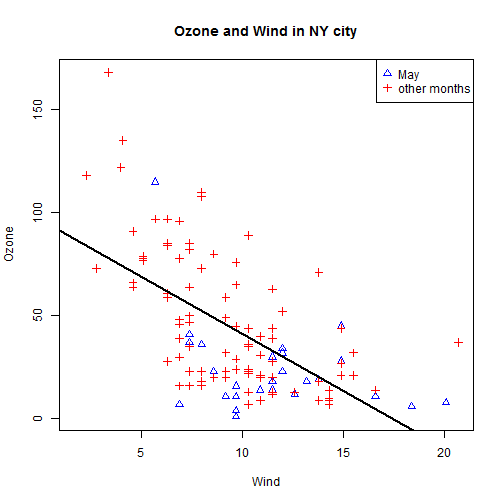 


Let us review a few more type of plots very quickly:

Scatter plot using the "plot" function:

```r
par(mfrow = c(1, 2))  # setting up a two panel plot
with(airquality, {
    
    plot(Wind, Ozone, main = "Ozone and Wind")
    plot(Solar.R, Ozone, main = "Ozone and Solar Radiation")
    
})
```

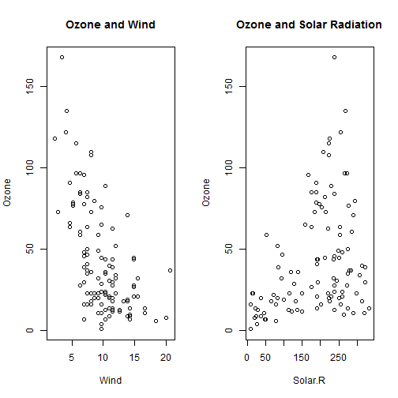 


Histogram using the  "hist" function:

```r
par(mfrow = c(1, 1))  # Single plot
hist(airquality$Ozone)
```

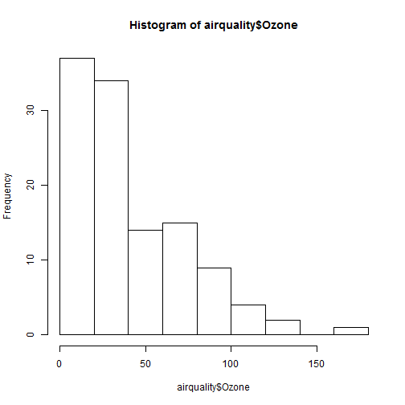 


Boxplot using the  "boxplot" function:

```r
par(mfrow = c(1, 1))  # Single plot
testdf <- transform(airquality, Month = factor(Month))
boxplot(Ozone ~ Month, testdf)
```

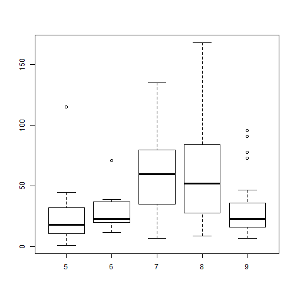 


### Graphics parameters

There are some basic graphics parameters that are used in this plotting system. A partial list  follows:  

* pch: is the plotting symbol
* col: refers to the color attribute
* lty: line type
* xlab.yab: X and Y labels
* mar: margins
* mfrow,mfcol: defines the number of panels row-wise vs col wise
* par("<parameter>"): provides current values of parameter
* par(parameter=new value) sets new values for parameter

### Graphics Devices

The base plotting package prints the plots to "graphic devices". These can either be the screen device or a file device. 

* Screen Device: This is called quartz() in mac, windows() in windows etc
* File devices: These are further broken down into Vector and Bitmap devices
* Vector File devices: line type interfaces, Resizes well, Portable
* Bitmap File devices: Good for line drawings and images with solid color. Does not resize well

We can use dev.copy() to copy from screen device to a file device. Sometimes, when we do this, the plot does not appear exactly. In that case we directly call the file device to plot on it. 

## Lattice plotting system

This system is good for plotting several plots at the same time by levels of a conditioning variable. As an example:  
xyplot(y~x|f.g,data=dataframe) plots the scatter of y Vs x across all levels of f.g  


```r

library("lattice")
data(airquality)
xyplot(Ozone ~ Wind, data = airquality)  # basic scatter plot
```

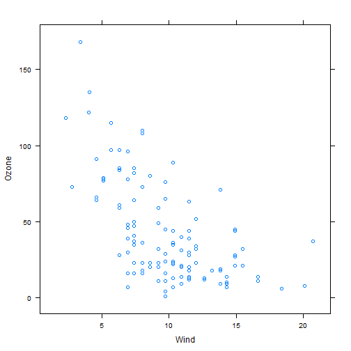 

```r
testdf <- airquality
testdf <- transform(testdf, Month = factor(Month))

# scatter plot by month
xyplot(Ozone ~ Wind | Month, data = testdf, layout = c(5, 1))
```

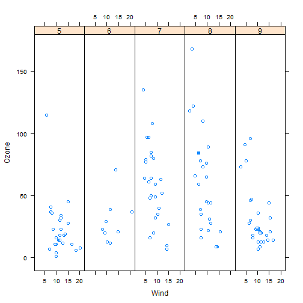 

```r

```


### Some key functions in lattice package

* xyplot: for scatterplot per our example above
* histogram
* bwplot: box and whiskers plot
* Others like stripplot, dotplot, splom, levelplot, contour plot

### Additional notes on lattice package

* The functions above return object of type "trellis"
* these objects are autoprinted in command line and hence the plot appears on screen
* the trellis objects can technically be assigned on variables and stored for later use
* print functions within the lattice packages get the plot on to the various graphics devices
* panel in lattice functions allow us to write custom functions that help control appearance of the  panels. there are default implementations that are involved if we dont override.  

## ggplot2 package

This package implements the "grammar of graphics" which is an abstraction of graphical concepts, ideas and their inter-relations.  
  
Statistical graphs are "mapping of data to aesthetic attributes ( color, shape) of geometric objects (points, lines, bars etc)".  
Plots may also contain statistical transformation of data and is drawn on a coordinate system.    

* the qplot() is the quickplot function that is easy, good-looking (+ lots of defaults pre-set)
* ggplot() is the work-horse function, that can be used to customize

### The qplot() function

* Data supplied in dataframes
* Made up of aesthetics (size, shape, colors) and geoms(points, lines)
* Facets parameters use the Factor levels of the conditioning variables and are similar in concept to what we have in lattice > supports f.g operation


```r

library(ggplot2)
qplot(Wind, Ozone, data = testdf, facets = . ~ Month)
```

```
## Warning: Removed 5 rows containing missing values (geom_point).
## Warning: Removed 21 rows containing missing values (geom_point).
## Warning: Removed 5 rows containing missing values (geom_point).
## Warning: Removed 5 rows containing missing values (geom_point).
## Warning: Removed 1 rows containing missing values (geom_point).
```

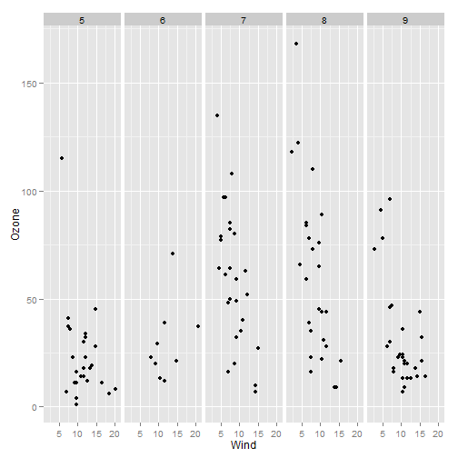 

```r
# testdf has been defined before with months as factors
```


The figure above is a very clean looking output which is why I prefer the ggplot2 function. We can add smoothers to the plots as below.  


```r

qplot(Wind, Ozone, data = testdf, facets = . ~ Month, geom = c("point", "smooth"))
```

```
## geom_smooth: method="auto" and size of largest group is <1000, so using loess. Use 'method = x' to change the smoothing method.
```

```
## Warning: Removed 5 rows containing missing values (stat_smooth).
```

```
## geom_smooth: method="auto" and size of largest group is <1000, so using loess. Use 'method = x' to change the smoothing method.
```

```
## Warning: Removed 21 rows containing missing values (stat_smooth).
```

```
## geom_smooth: method="auto" and size of largest group is <1000, so using loess. Use 'method = x' to change the smoothing method.
```

```
## Warning: Removed 5 rows containing missing values (stat_smooth).
```

```
## geom_smooth: method="auto" and size of largest group is <1000, so using loess. Use 'method = x' to change the smoothing method.
```

```
## Warning: Removed 5 rows containing missing values (stat_smooth).
```

```
## geom_smooth: method="auto" and size of largest group is <1000, so using loess. Use 'method = x' to change the smoothing method.
```

```
## Warning: Removed 1 rows containing missing values (stat_smooth).
## Warning: Removed 5 rows containing missing values (geom_point).
## Warning: Removed 21 rows containing missing values (geom_point).
## Warning: Removed 5 rows containing missing values (geom_point).
## Warning: Removed 5 rows containing missing values (geom_point).
## Warning: Removed 1 rows containing missing values (geom_point).
```

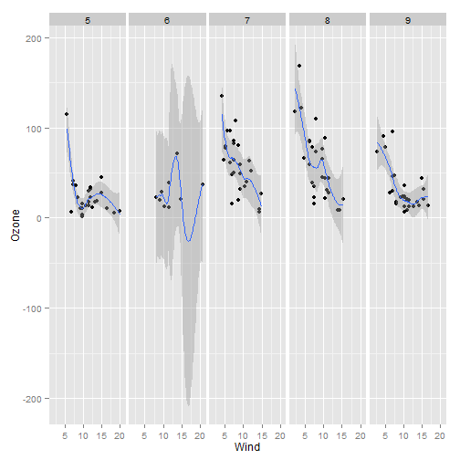 

```r
# the default smoother is 'loess'
```


we can add linear smoothers as well as follows.  


```r

qplot(Wind, Ozone, data = testdf, facets = . ~ Month, geom = c("point", "smooth"), 
    method = "lm")
```

```
## Warning: Removed 5 rows containing missing values (stat_smooth).
## Warning: Removed 21 rows containing missing values (stat_smooth).
## Warning: Removed 5 rows containing missing values (stat_smooth).
## Warning: Removed 5 rows containing missing values (stat_smooth).
## Warning: Removed 1 rows containing missing values (stat_smooth).
## Warning: Removed 5 rows containing missing values (geom_point).
## Warning: Removed 21 rows containing missing values (geom_point).
## Warning: Removed 5 rows containing missing values (geom_point).
## Warning: Removed 5 rows containing missing values (geom_point).
## Warning: Removed 1 rows containing missing values (geom_point).
```

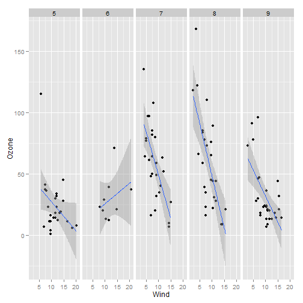 

```r
# changing the smoothing method to 'linear model'
```


The colors of the geoms can also be modified by assigning them to a conditioning variable as follows. We demonstrate this with our iris data set that has three species of flowers represented in the 150 sample dataframe.


```r

data(iris)  # loading iris dataset
qplot(Sepal.Length, Sepal.Width, data = iris, col = Species, geom = c("point", 
    "smooth"))
```

```
## geom_smooth: method="auto" and size of largest group is <1000, so using loess. Use 'method = x' to change the smoothing method.
```

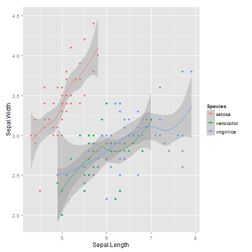 

```r
# colors are based on values of species also added a default loess smoother
```


Histograms are created by referencing just one variable in the qplot function.


```r

qplot(Sepal.Length, data = iris, facets = . ~ Species)
```

```
## stat_bin: binwidth defaulted to range/30. Use 'binwidth = x' to adjust this.
## stat_bin: binwidth defaulted to range/30. Use 'binwidth = x' to adjust this.
## stat_bin: binwidth defaulted to range/30. Use 'binwidth = x' to adjust this.
```

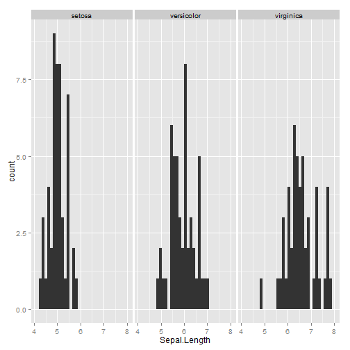 

```r
# histogram is based on length of Sepals
```


We can also have a joint histogram with conditioning variable highlighted with the larger distribution as below:


```r

qplot(Sepal.Length, data = iris, fill = Species)
```

```
## stat_bin: binwidth defaulted to range/30. Use 'binwidth = x' to adjust this.
```

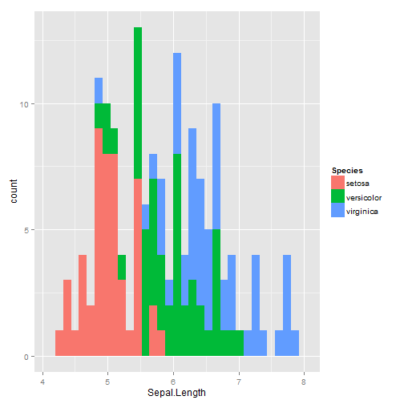 

```r
# the histogram color is controlled by parameter fill which varies based on
# species
```


With qplot, we can also plot density functions of the variable :


```r

qplot(Sepal.Length, data = iris, geom = "density")
```

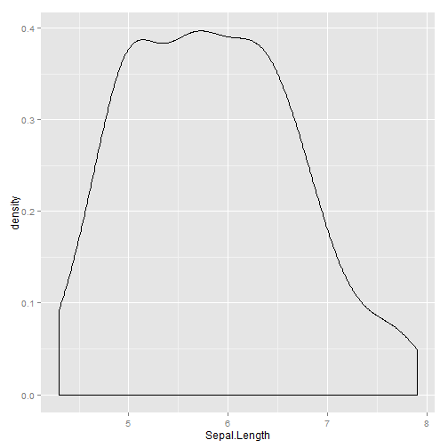 


which we can also condition as below:


```r

qplot(Sepal.Length, data = iris, geom = "density", col = Species)
```

 

